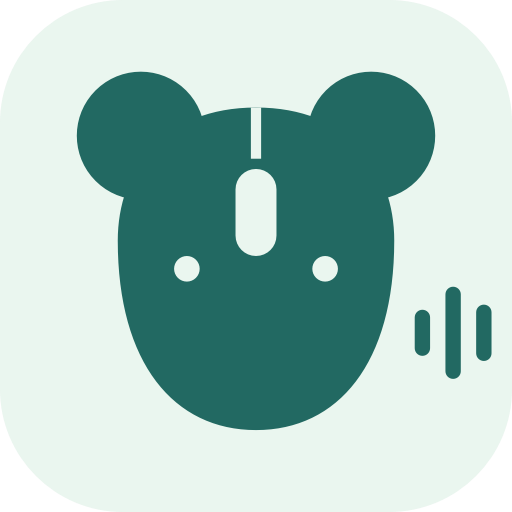

# 鼠语 MouseTalk



随口说，随手发。A wireless mouse becomes a small voice-input remote.

A small, local-only macOS menu bar app that maps extra mouse buttons to a
modifier shortcut, Return, or Backspace. It was originally built to control a
voice-input shortcut without reaching for the keyboard, but it works with any
macOS app that accepts the configured shortcut.

The app does not use the network, collect analytics, record audio, or read the
contents of your keystrokes. It listens for standard `otherMouseDown` and
`otherMouseUp` events and emits the actions you configure. The shortcut check
also reads system shortcut metadata, running apps' public menu commands and
supported local remapping preferences; it never triggers those commands.

## Features

- Bind an extra mouse button to one modifier key or a two-key combination.
- Bind separate buttons to Return and Backspace.
- Hold the Backspace button to repeat at the macOS keyboard-repeat rate.
- Suppress the original action of mapped side buttons.
- Choose regular `keyDown`/`keyUp` events or `flagsChanged` compatibility mode.
- Keep the app available from the menu bar after closing its settings window.
- Check for overlapping bindings, with the app, function, source and scope shown.
- Recognize direct mouse-button mappings in the selected Karabiner profile.
- Use the same vector mouse/rodent mark in the settings header, menu bar and app icon.
- Use the included CLI to compare single and double synthetic modifier events.

## Requirements

- macOS 13 or later
- Swift 6 toolchain (Xcode 16 or a compatible command-line toolchain)
- A mouse whose extra buttons generate standard macOS mouse-button events

The app needs two macOS permissions:

- **Input Monitoring** to receive extra mouse-button events.
- **Accessibility** to emit the configured keyboard events.

These permissions are powerful. Build from source, inspect the code, and only
grant them if you trust the executable you are running.

## Build the app

```bash
git clone https://github.com/TryAILab/double-click-mouse.git
cd double-click-mouse
./build-app.sh
open "dist/MouseTalk.app"
```

The build script uses ad-hoc signing by default and never searches your
keychain. To use a specific signing identity, pass it explicitly:

```bash
SIGNING_IDENTITY="Developer ID Application: Example" ./build-app.sh
```

Move the built app to `/Applications` if you want a stable path. A rebuild with
ad-hoc signing can cause macOS to request permissions again.

## Configure

1. In the target app, assign the action you want to control to one modifier key
   or a two-modifier combination.
2. Open 鼠语 MouseTalk and grant Input Monitoring and Accessibility.
3. Bind an extra mouse button to **Shortcut**, **Return**, or **Backspace**.
4. Set the app's output shortcut to exactly match the target app.
5. Use **Test output** before enabling the mouse mapping.

The UI currently uses Simplified Chinese. Button numbers are displayed in both
Core Graphics' zero-based form and the conventional one-based form.

## Shortcut overlap checks

The check refreshes after button/output changes; **重新检查** repeats it after
other apps' settings change. It runs off the UI thread after capturing the
system hotkeys on the main thread, with a bounded menu scan. It checks:

- Enabled macOS symbolic hotkeys through `CopySymbolicHotKeys`. Apple does not
  expose the function names through this API; these results show a keycode and
  explicitly require verification in System Settings.
- Running apps' accessible, enabled menu shortcuts and their app/function names.
- `NSUserKeyEquivalents` overrides for global menus and running applications.
- Direct `pointing_button` mappings from Karabiner's selected profile. Complex
  rules can depend on devices, apps or variables and are reported as possible overlaps.

This is **not an exhaustive registry of every app's shortcuts**. Modifier-only
listeners, double-tap gestures, closed apps, private global hotkeys, and vendor
mouse-driver mappings may be unavailable. Logi Options+, BetterTouchTool and
other detected drivers are listed as coverage gaps, never invented conflicts.
Menu overlap is local to that app/focus, not necessarily a global conflict.
Matching the intended voice-input application's shortcut is expected.

No other app's settings are changed. Results are kept in memory only, with
source/limitations visible in the UI. No match means no overlap was found in the
readable subset, not guaranteed conflict-free operation. Left/right modifier
identity and tap-count semantics may not be published by the source.

`mousetalk-check --scan` is a read-only diagnostic with **sample** bindings
(right Option on button 4, Return on button 5, Backspace on button 3), not an
export of the GUI's current preferences. It never emits keyboard events or
requests permissions. Build it with `swift build --product mousetalk-check`.

The bundle identifier and executable name of the open-source version remain
stable. On first launch, only known tool settings missing from the new defaults
are imported from the earlier `com.tryailab.doubao-mouse` experiment; source
preferences remain intact. Moving from that differently identified app may
require fresh macOS privacy permissions. Run only one version at a time.

Repository check on 2026-09-14: the local base was `ad00d18`; the old AaronZ021
URL redirects to TryAILab. GitHub reported that destination as an empty Git
repository, so there was no remote commit to compare or pull. This local checkout
had no configured remote. Publishing source remains a separate action.

## CLI event experiment

The companion CLI helps determine which synthetic modifier-event shape a target
app accepts:

```bash
swift build -c release --product double-click-key-test
.build/release/double-click-key-test send --dry-run
.build/release/double-click-key-test send --mode single --style keyboard
.build/release/double-click-key-test send --mode double --style keyboard
.build/release/double-click-key-test send --mode single --style flags-changed
.build/release/double-click-key-test send --mode double --style flags-changed
```

Run with `--help` to see timing, source, and key options. Without `--dry-run`,
the CLI posts synthetic keyboard events and therefore requires Accessibility.

## Limitations

- Only standard extra-button events are supported. Vendor-specific gesture
  buttons may require an IOHID-based implementation.
- The app does not create real hardware HID reports; it posts Core Graphics
  synthetic events.
- Mapped button-down events are suppressed. The corresponding button-up event
  is allowed through so macOS does not retain a stuck mouse-button state.
- There are no prebuilt, notarized releases yet.

## Development

```bash
swift build
swift test
swift build -c release
.build/release/double-click-key-test send --dry-run
```

The project has no third-party runtime dependencies.
The app package is produced by `./build-app.sh`; the vector app icon is rendered
from `Sources/MouseTalkKit/Brand.swift` during that build.

## Security and privacy

See [SECURITY.md](SECURITY.md) for the permission model and vulnerability
reporting guidance.

## License

MIT. See [LICENSE](LICENSE).
